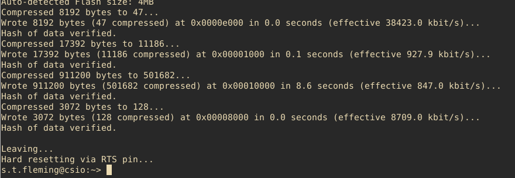
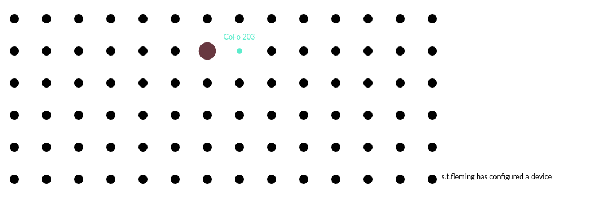

# EmSys setting up your lab environment (Take 2) 

Working in the EmSys lab requires you to connect to a specific machine in the Linux lab which has the ESP32 and Logic Analyser attached. 

__See this [list](https://github.com/STFleming/EmSys_labSetup/tree/main/allocations) to find out which machine your group has been allocated to.__ 

## Windows/Mac/Linux VSCode setup guide
__I highly recomend going this route.__

[[Visual Studio Code](https://code.visualstudio.com/download)] is a cross platform developer tools from Microsoft. 
It has a [[remote development extension pack](https://marketplace.visualstudio.com/items?itemName=ms-vscode-remote.vscode-remote-extensionpack)] that enables it to integrate seamlessly with ssh.

[[I have created a video guide explaining how to set it up and compile a HelloWorld program for your TinyPico.](https://youtu.be/R_lnu_3s5aA)] 

_Thanks @mortie for recomending me to try it, much appreciated._

-----------------------------------------------------
## Alternative more manual approach
There are five parts to this approach:
1. Connecting to your Lab Machine (Windows/Linux/Mac)
2. Setting up your environment
3. Transfering a sketch from your machine to your Linux lab machine 
4. Compiling and uploading your first TinyPico program 
5. Looking at the serial output of your TinyPico device

Each step must be completed in order.

-----------------------------------------------------

## Connecting to your setup

__Guide for Linux / Mac__
Open a terminal and type in the following
``` 
        ssh <YOUR STUDENT ID>@<ALLOCATED MACHINE>
```

You will be presented with a bash shell running on your Linux machine.

__Guide for Windows__


In the ``Host Name (or IP address)`` put the address of your groups allocated machine.

------------------------------

## Development environment setup

[[Video on setting up your development environment](https://youtu.be/ucdD1zjaWeg)]

Copy and paste the following command into your ssh terminal and execute it (hit enter).

__WARNING__: This command attempts to clean up some of the mess created by the last lab, you should ensure than any code you wrote in the previous lab session is backed up. In particular this script will remove the following folders in your Linux home directory: ``~/Arduino``, ``~/.arduino15``, ``~/EmSys_labSetup``.  


```
curl -o- https://raw.githubusercontent.com/STFleming/EmSys_labSetup/main/setup.sh | bash -

```
If successful the output should look like the image below, showing that a program has been successfully written into the flash memory of the TinyPico, and that the device has been reset.



Then navigate to the EmSys virtual labpage: [http://ec2-18-222-206-236.us-east-2.compute.amazonaws.com:4000/](http://ec2-18-222-206-236.us-east-2.compute.amazonaws.com:4000/)

You should see a message printed that your username has successfully configured a device. This means that your device was programmed and was able to connect to the wider network in the lab.



*Note: this last step where you see the message on the virtual lab-server isn't the most reliable, so don't panic if it doesn't show up*

--------------------------------

## Transfering a sketch from your machine to your Linux lab machine 

Unless you are comfortable with command-line based text editors, such as vim, my advice would be to edit your TinyPico programs on your home machine and transport the relevant files across to the Linux lab machines.

[[video guide for linux](https://youtu.be/yt0RVEX1274)]

__For Windows/Mac I recomend using the VSCode approach at the top of this page__

---------------------------------------

## Compiling and uploading your first TinyPico program 

[[video guide on how to compile and upload your HelloWorld program to your TinyPico](https://youtu.be/uddiqhSN3Ks)]

To compile a TinyPico program on one of the EmSys machines type:

```
        emsys_compile HelloWorld
```

Where ``HelloWorld/`` is a directory containing the TinyPico program ``HelloWorld.ino``.

To upload a program to your TinyPico type:

```
        emsys_upload -p /dev/ttyUSB0 HelloWorld
```

Where ``HelloWorld/`` is a directory containing the TinyPico program ``HelloWorld.ino``;
and ``/dev/ttyUSB0`` is the port that your TinyPico is connected to.

Most of the time leaving ``/dev/ttyUSB0`` should be fine. However, if this upload fails type ``ls /dev`` to see how many ``ttyUSB*`` devices you can see. Try uploading to each of them. If they all fail, or you cannot see any, call for help.

----------------------------------------

## Looking at the serial output of your TinyPico device

[[video guide on how to examine the serial output of your TinyPico](https://youtu.be/4D6jT0egP9E)]

To view the serial output type:

```
        screen /dev/ttyUSB0 115200
```
Where ``/dev/ttyUSB0`` is the device you uploaded to (see previous section), and ``115200`` is the baud rate that you set when establishing the serial connection (see the video on transferring your code).

You should now see the serial messages appearing on the console screen. To exit screen hit ``control + a`` and then press ``k``. You will then see a question at the bottom of the screen asking if you want to close screen, hit ``y``. 

__Important__: You cannot have ``screen /dev/ttyUSB0`` open and try to upload code to ``/dev/ttyUSB0`` at the same time. You must close the screen connection before you can upload your code.
