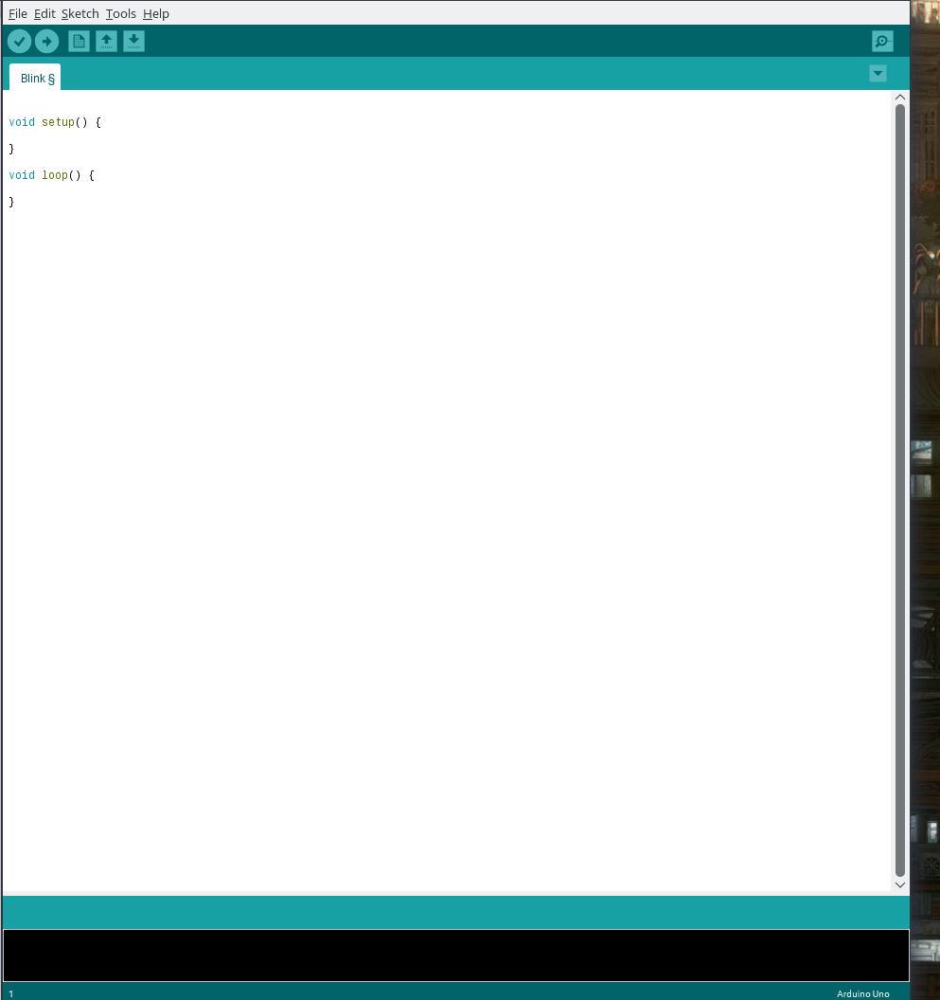

# EmSys Setting up your Lab environment (Take 2) 

Working in the EmSys lab requires you to connect to a specific machine in the Linux lab which has the ESP32 and Logic Analyser attached. 

__See this [list](https://github.com/STFleming/EmSys_labSetup/tree/main/allocations) to find out which machine your group has been allocated to.__ 

First you need to connect to a linux machine via ssh (see section Connecting to your Linux Machine), then you need to setup your environment (see Section Setting up your development environment).

## Connecting to your setup

__Guide for Linux / Mac__
Open a terminal and type in the following
``` 
        ssh <YOUR STUDENT ID>@<ALLOCATED MACHINE>
```

You will be presented with a bash shell running on your Linux machine.

__Guide for Windows__


1. In the ``Host Name (or IP address)`` put the address of your groups allocated machine.

## Cleaning your previous environment

The first thing that we need to do is to cleanup all stuff that was left 

1. connect via ssh to your machine ```ssh <YOUR STUDENT ID>@<ALLOCATED MACHINE>```
2. Execute the following in the shell
```
        rm -rf ~/.arduino15
```
3. Execute the following in the shell
```
        rm -rf ~/Arduino
```
4. Execute the following in the shell
```
        rm -rf ~/Arduino
```


## Setting up your development environment

Connect via ssh to your designated Linux machine and type the following into the ssh terminal:
1. clone the setup repository
```
git clone https://github.com/STFleming/EmSys_labSetup.git 
```
2. Navigate into the EmSys_labSetup directory
```
cd EmSys_labSetup
```
3. run the setup script -- will take a few minutes so have a cup of tea
```
./setup.sh
```

Once those have completed then log out and log back in again (remember to have X-fowarding on when you log back in -X -C). To test out your environment type in ```arduino```. The Arduino IDE should load and look like the following.



Make sure you can select the correct board in the Arduino IDE. Go to:

```
Tools -> Boards -> ESP32 Arduino -> TinyPico
```

-----------------------------------------

And you should now be ready to go!


### FAQ
* I keep getting ``Unknown cipher type ...`` error? 
> Make sure that you are using capitals for the ssh flags, i.e. use "-X -C" not "-x -c"

